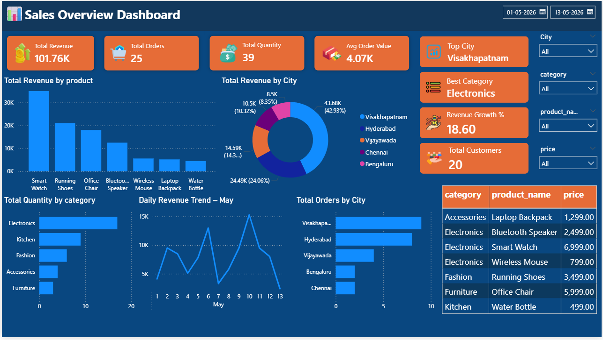

# 🛒 E-Commerce Sales Analytics Dashboard

<p align="center">
  
</p>

## 📌 Project Overview

This project presents an interactive **Power BI dashboard** designed to analyze e-commerce sales performance across products, customers, regions, and time periods.

The dashboard transforms raw transactional data into actionable insights that support strategic decision-making, helping stakeholders monitor business performance, identify growth opportunities, and optimize operations.

---

## 🎯 Business Objectives

- Monitor overall sales and profitability trends
- Identify top-performing products and categories
- Analyze customer purchasing behavior
- Evaluate regional sales performance
- Track key performance indicators (KPIs)
- Discover seasonal and monthly sales patterns

---

## ❓ Key Business Questions

- Which products and categories generate the highest revenue?
- Which regions contribute the most to profit?
- How do sales trends vary over time?
- What is the average order value?
- Which customer segments drive repeat purchases?
- Are there any low-performing products impacting profitability?

---

## 🛠️ Tools & Technologies

| Category | Tools |
|----------|-------|
| Business Intelligence | Power BI |
| Data Transformation | Power Query |
| Data Modeling | DAX |
| Data Source | Excel / CSV / SQL |
| Visualization | Power BI Visuals |

---

## 📊 Key Performance Indicators (KPIs)

- 💰 Total Sales
- 📦 Total Orders
- 👥 Total Customers
- 📈 Profit Margin
- 🛍️ Average Order Value
- 🔄 Repeat Purchase Rate

---

## 📈 Dashboard Features

- Interactive slicers and filters
- Dynamic KPI cards
- Time-series analysis
- Product performance tracking
- Regional sales mapping
- Customer segmentation
- Drill-through capabilities

---

## 🔍 Key Insights

- A small percentage of products contribute significantly to total revenue.
- Sales demonstrate strong seasonality during promotional periods.
- Certain regions generate higher profit margins despite lower sales volumes.
- Repeat customers contribute substantially to overall revenue.
- Some high-volume products have low profitability, indicating optimization opportunities.

---

## 🗂️ Repository Structure

```text
e-commerce-sales-analytics/
│
├── dashboard/
│   └── ecommerce-sales-dashboard.pbix
│
├── data/
│   └── sample_dataset.csv
│
├── images/
│   ├── dashboard-overview.png
├── docs/
│   └── project-summary.pdf
│
└── README.md
```
---
## 🚀 Getting Started

### Prerequisites

- Power BI Desktop

### Installation

1. Clone this repository:

```bash
git clone https://github.com/CHELLURU-AJHITH-KUMAR/e-commerce-sales-analytics.git
```

2. Open:

```text
dashboard/ecommerce-sales-dashboard.pbix
```

3. Refresh the data source if required.

---

## 👤 Author

**Chelluru Ajhith Kumar**

Aspiring Data Analyst | Power BI Developer | SQL | Python

- GitHub: https://github.com/CHELLURU-AJHITH-KUMAR
- LinkedIn: https://linkedin.com/in/ajhith-kumar-chelluru

---

⭐ If you found this project useful, consider giving it a star.
